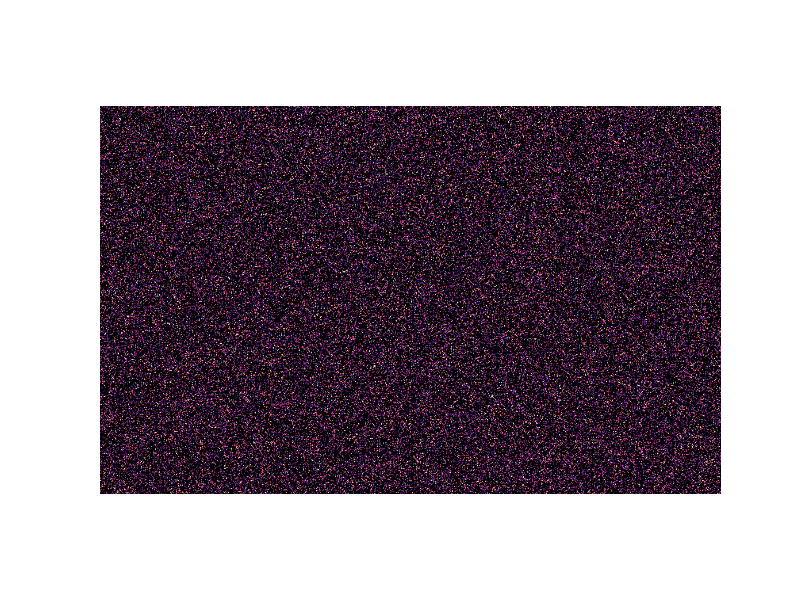
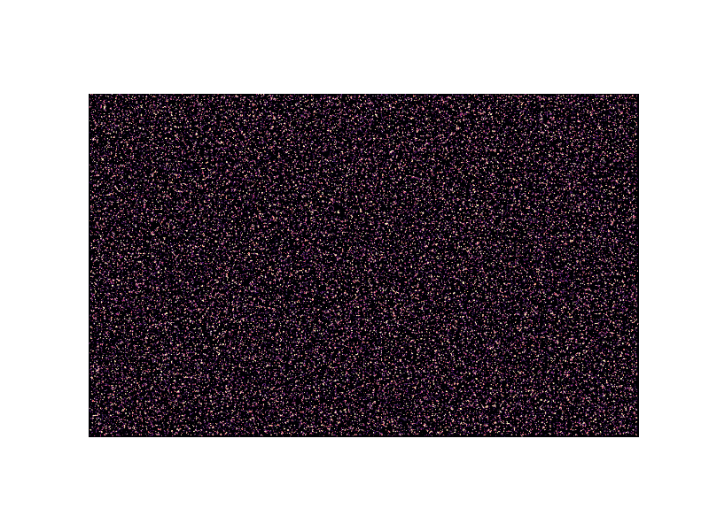
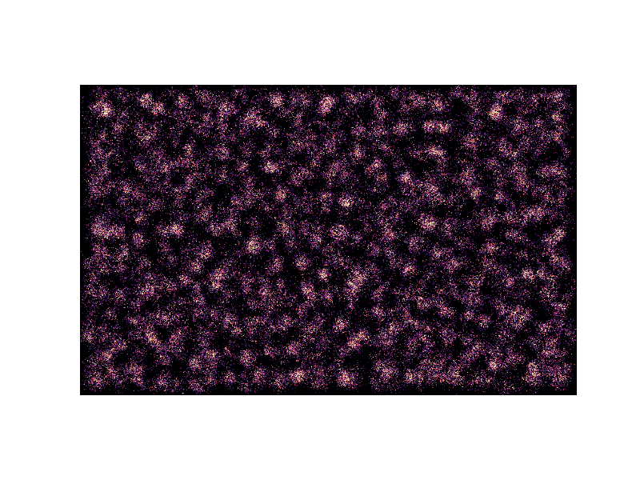
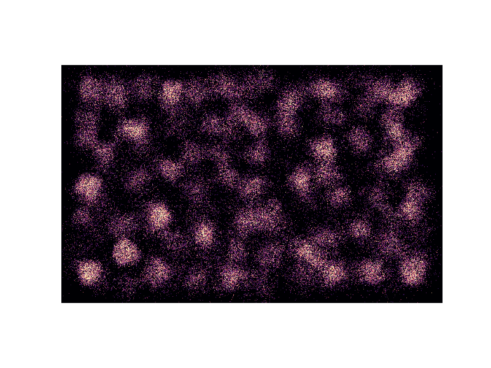

# N body simulation

This code uses Particle-Mesh method to simulate gravitational systems with N particles. The potential is solved using FFT on a fixed Cartesian mesh, the force on the mesh is derived from 4th order differentiation of potential field, and is interpolated using the same cloud-in-cell method as assigning particles to grid.

Here's an example for 100000 particles.

Random field at begining: 

After 10 iteration:

After 50 iteration:

After 100 iteration:

